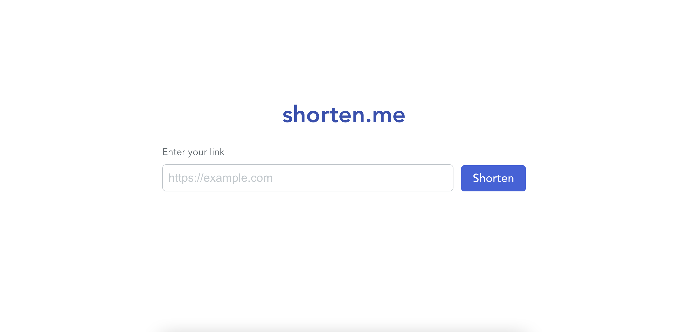

Hi there! This is an example single-page URL shortening application built using React and Node.js, written in TypeScript.

# Tech stack

The frontend tech stack consists of:
- [React](https://reactjs.org/) (UI library/framework)
- [Vite](https://vitejs.dev/) (bundler)
- [Radix UI](https://www.radix-ui.com/) + [Stitches](https://stitches.dev/) (styling)
- [Jest](https://jestjs.io/) / [React Testing Library](https://testing-library.com/docs/react-testing-library/intro/) (component testing)
- [Cypress](https://www.cypress.io/) (end-to-end testing)

The backend tech stack consists of:
- [NestJS](https://nestjs.com/) (backend framework)
- [Postgres](https://www.postgresql.org/) (database)
- [Prisma](https://www.prisma.io/) (ORM)

Other tooling:
- [Docker](https://www.docker.com/) (for spinning up a local Postgres instance)
- [ESLint](https://eslint.org/) (linting)
- [Prettier](https://prettier.io/) (formatting)

# Getting started

Before running the application, please make sure to have the following tools installed:
- docker and docker-compose (see https://docker-docs.netlify.app/compose/install/ for instructions)
- npm and node (for example, using https://volta.sh/)

There is a small shell script to install dependencies and start the local Postgres database. Simply run `./init.sh` to get started.

To start the backend, run the following commands in the terminal:
```sh
cd server
npx prisma migrate dev
npm run start:dev
```

To start the frontend , run the following commands in a separate terminal:
```sh
cd ui
npm run dev
```

Both frontend and backend should now be up and running.

The frontend can be accessed at http://localhost:8080. The backend will be running at http://localhost:3000 and the OpenAPI documentation can be found at http://localhost:3000/api.

The application should look like this.


Try it out by entering a valid URL in the input field and clicking the "Shorten" button. The page should display the short link as well as the original link. Clicking on the short link will open a new tab which will then be redirected to the original link.

# Testing

Tests have been added for both the backend and the frontend.

There are unit, integration, and end-to-end tests on the backend. To run them, use the following commands:
```sh
cd server
npm run test
```
for unit and integration tests, and
```sh
cd server
npm run test:e2e
```
for end-to-end tests.

For the frontend, there are integration tests with React Testing Library and end-to-end tests with Cypress. To run them, use the following commands:
```sh
cd ui
npm run test
```
for unit and integration tests, and
```sh
cd ui
npm run test:e2e
```
for end-to-end tests.

The latter will open the Cypress UI where the test can be run interactively by clicking on `app.cy.ts`. Make sure that the frontend application is up before running the tests.

# Future improvements

There are many things that can be improved. One would be a cache (e.g. Redis) to store the mapping between short link and original link to avoid hitting the database on every request. Observability is also important. Metrics and tracing can be added to the application using OpenTelemetry, which can be exported to different platforms like Prometheus + Grafana, Datadog, and New Relic. An API key can be introduced to protect against unauthorized access and implementing rate-limiting can prevent DDoS attacks.